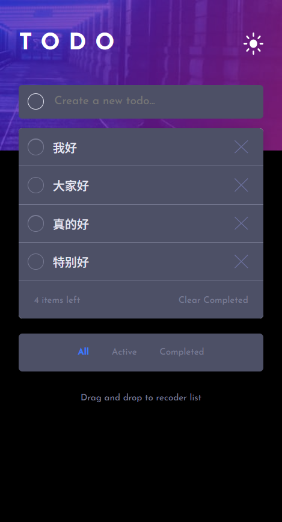

# Frontend Mentor - Todo app solution

This is a solution to the [Todo app challenge on Frontend Mentor](https://www.frontendmentor.io/challenges/todo-app-Su1_KokOW). Frontend Mentor challenges help you improve your coding skills by building realistic projects. 

## Table of contents

- [Overview](#overview)
  - [The challenge](#the-challenge)
  - [Screenshot](#screenshot)
  - [Links](#links)
- [My process](#my-process)
  - [Built with](#built-with)
  - [What I learned](#what-i-learned)
  - [Continued development](#continued-development)
- [Author](#author)

## Overview

### The challenge

Users should be able to:

- View the optimal layout for the app depending on their device's screen size
- See hover states for all interactive elements on the page
- Add new todos to the list
- Mark todos as complete
- Delete todos from the list
- Filter by all/active/complete todos
- Clear all completed todos
- Toggle light and dark mode

### Screenshot




### Links

- Solution URL: [solution in github](https://github.com/Ekin-shieh/todo-app)
- Live Site URL: [live site in gitpage](https://ekin-shieh.github.io/todo-app/)

## My process

### Built with

- Semantic HTML5 markup
- CSS custom properties
- Flexbox
- Mobile-first workflow
- Vanilla JavaScript
- TypeScript
- localStorage

### What I learned

Through this Todo App project, I reinforced several key frontend development skills, including:
- Using semantic HTML5 tags to build a well-structured layout
- Creating responsive designs with Flexbox and Grid for both mobile and desktop
- Implementing light/dark theme toggling using classList.toggle()
- Dynamically creating, updating, and deleting task elements with JavaScript
- Persisting task data using localStorage
- Enhancing code maintainability and type safety with TypeScript
- Refreshing the task list dynamically after actions like completing or deleting tasks
For example, I implemented modules like:

```ts
model.addEventListener('click', ()=>{
    if (model.src.includes('icon-sun.svg')) {
        model.src = './images/icon-moon.svg';
    } else {
        model.src = './images/icon-sun.svg';
    };
    container.classList.toggle('night');
});
```

```ts
function saveTasksToStorage(tasks: Task[]): void {
  localStorage.setItem(LOCAL_STORAGE_KEY, JSON.stringify(tasks));
}
```

```ts
function filterAndRenderTasks(filter: "all" | "active" | "completed"): void {
  const tasks = loadTasksFromStorage();
  let filteredTasks: Task[] = [];

  if (filter === "all") {
    filteredTasks = tasks;
  } else if (filter === "active") {
    filteredTasks = tasks.filter(task => !task.completed);
  } else if (filter === "completed") {
    filteredTasks = tasks.filter(task => task.completed);
  }

  itemNum.textContent = `${filteredTasks.length} items left`;

  const list = document.getElementById("todo-list")!;
  list.innerHTML = "";
  filteredTasks.forEach(renderTask);
}
```

### Continued development

Although I successfully implemented most of the core features of the Todo App, the drag-and-drop sorting functionality proved to be complex. It involves handling multiple events (dragstart, dragover, drop, dragend) and dynamically inserting elements between others. I initially attempted to build this feature using the native Drag and Drop API, but due to the detailed event logic and strict type constraints in TypeScript, I eventually decided to skip it and focus on completing the rest of the features.

In the future, I plan to:
- Learn to implement drag-and-drop functionality using third-party libraries like react-beautiful-dnd in React projects
- Gain a deeper understanding of DOM operations and the event model to better handle complex interactions
- Refactor the project structure by separating UI and logic for better code reusability and modularity
- Explore CSS animations or libraries like Framer Motion to enhance user experience

## Author

- Frontend Mentor - [@Ekin-shieh](https://www.frontendmentor.io/profile/Ekin-shieh)
- GitHub - [@Ekin-shieh](https://github.com/Ekin-shieh)
